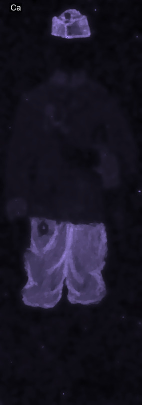
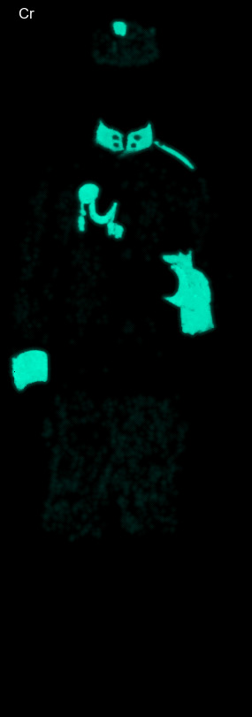
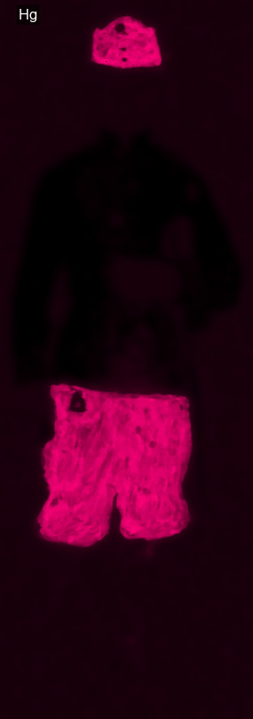
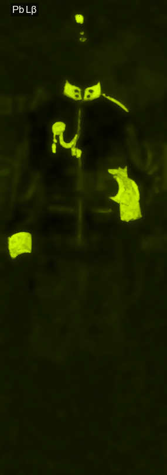
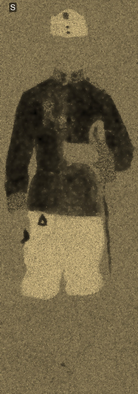
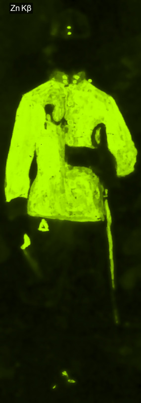

# correlate-element-maps
https://github.com/almaavu/correlate-element-maps

**Korelace MA-XRF or SEM-EDS prvkových map.** 
 Výpočet Personova korelačního koeficientu dvojic map, uložení tabulky s výsledky do XLS souboru. 

### Instalace:
Instalace programovacího jazyka Python3

    https://www.python.org/downloads/
    
Instalace programu correlate-element-maps

    python -m pip install git+https://github.com/almaavu/correlate-element-maps.git

### Použití:

    python -m correlate_element_maps --maps-dir="d:/maps"
    
Skript je možné spustit i bez instalace:

    python correlate_element_maps.py --maps-dir="d:/maps"

### Vstup: 
- Cesta a názvy souborů prvkových map.
- Tabulka vybraných dvojic prvků určených pro výpočet korelace. (Alternativně lze korelace počítat pro všechny možné kombinace prvkových map, pokud je přijatelná delší doba potřebná pro výpočet.) 

### Zpracování:
- Načtení dvojic prvkových map. Obrázky se načítají do cache pro urychlení zpracování stejného obrázku v dalších krocích.
- Výpočet Pearsonova korelačního koeficientu.
- Zpracování výsledků ve formátu pandas DataFrame, řazení podle hodnoty r2.
- Uložení do XLS souboru.

### Výstup:
- XLS soubor s výsledky.

### Odkazy:

https://en.wikipedia.org/wiki/Pearson_correlation_coefficient

https://imagej.net/imaging/colocalization-analysis

## Ukázka:

### Prvkové mapy:

### Výsledek:

  
  

### Result:

  

