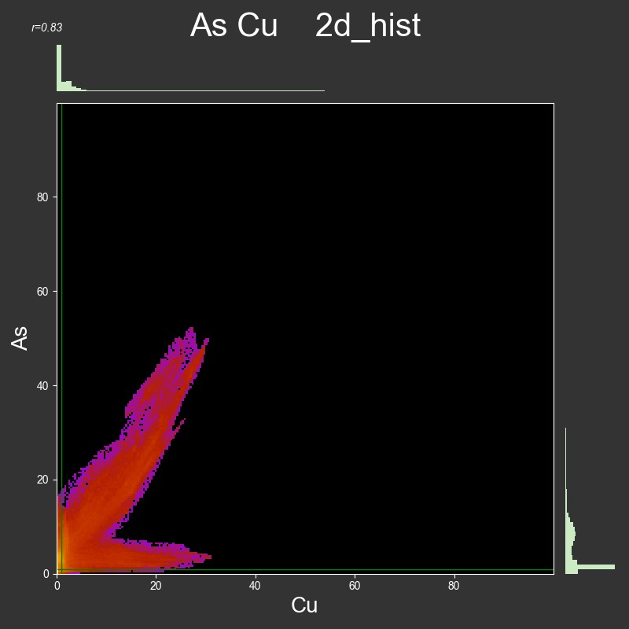
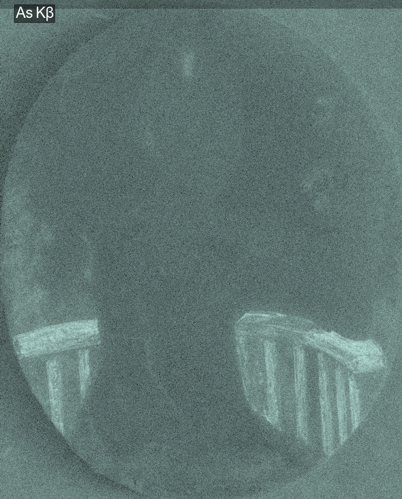
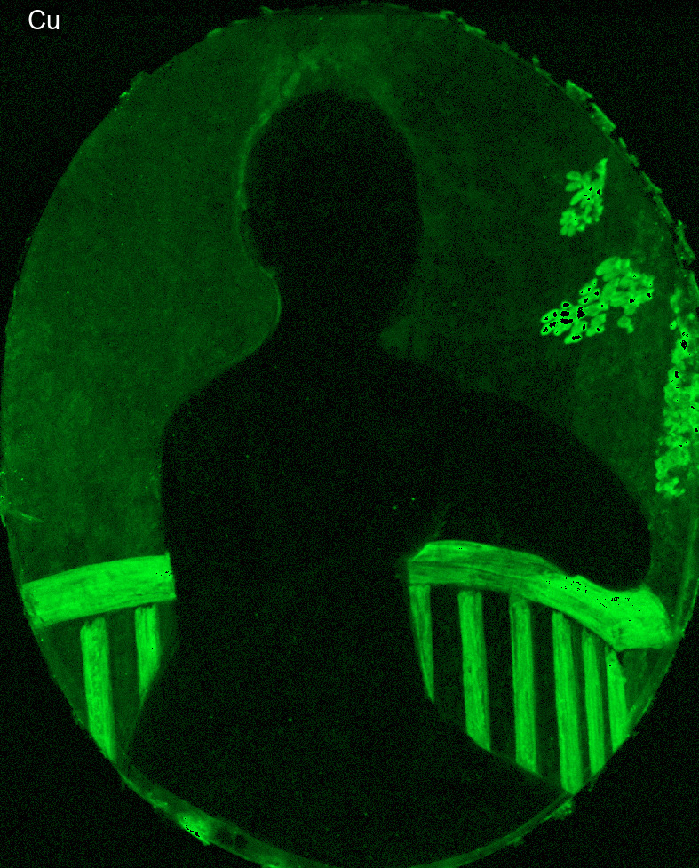
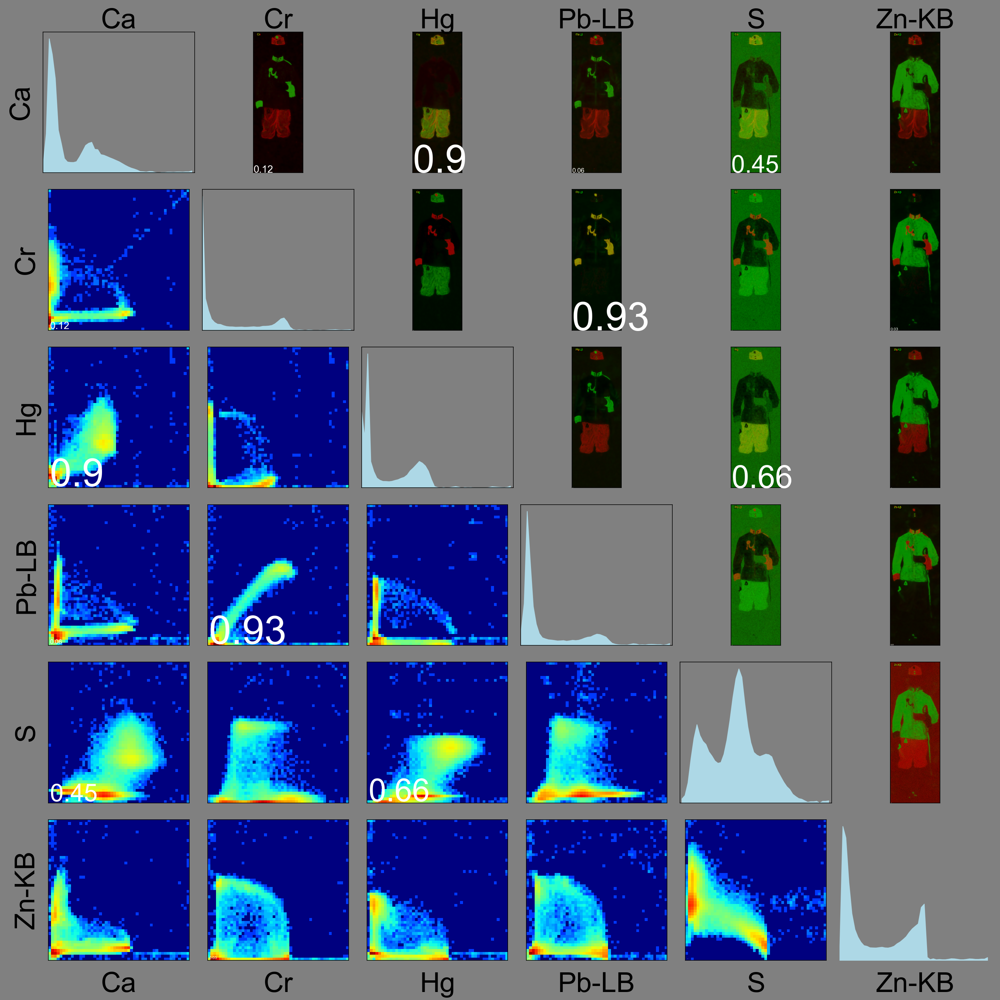

# Correlate Element Maps
https://github.com/almaavu/correlate-element-maps

**Korelace MA-XRF or SEM-EDS prvkových map.** 

Program pro obrazovou analýzu prvkových map získaných MA-XRF spektroskopií nebo SEM-EDS mikroskopií. Porovnává dvojice prvkových map a hledá míru jejich korelace - společného výskytu prvků, např. obsažených ve stejném pigmentu nebo materiálu podložky. Výsledky jsou uloženy do XLSX tabulky, která pro každou dvojici map uvádí Personův korelační koeficient, koeficient determinace a regresní koeficienty. [[1]](#1)

Dalším výstupem je korelační matice zobrazující 2D histogramy dvojic prvkových map a  překryvy map v RGB snímku. 

### Pearsonův korelační koeficient
Korelační koeficient vyjadřuje, nakolik jsou koncentrace dvou prvků provázané. Pokud jsou dva prvky součástní stejného pigmentu a nejsou-li obsaženy v další materiálech, např. Hg a S v rumělce, pak v místech s vysokou koncentrací rtuti je i vysoká koncentrace síry. Koncentrace prvků jsou pak do jisté míry lineárně závislé, lze je vyjádřit funkcí ve tvaru 
    
    c2 = m * c1 + b 

kde c2, c1 jsou koncentrace prvků, m je směrnice a b je úsek regresní přímky.

### 2D histogram

Grafické zobrazení korelace pomocí 2D histogramu ukazuje míru korelace i rozložení koncentrace v případě, že jsou prvky obsaženy ve více sloučeninách. Využití je podobné, jako při hledání překryvu snímků metodou kolokalizace ve fluorescenční mikroskopii. [[2]](#2) [[3]](#3)

Následující 2D histogram zobrazuje rozložení koncentrace arsenu a mědi v malbě, ve které jsou As a Cu přítomny ve formě svinibrodské zeleně a Cu je zároveň obsažena samostatně ve formě měděnky.

   

## Instalace:
Instalace programovacího jazyka Python3

    https://www.python.org/downloads/
    
Instalace programu correlate-element-maps

    python -m pip install git+https://github.com/almaavu/correlate-element-maps.git

Instalace knihoven:

    python -m pip install --upgrade requirements.txt
    
* numpy
* pandas
* matplotlib
* scipy
* scikit-image
* imageio

## Použití:

    python -m correlate_element_maps --maps-dir="d:/maps"
    
Skript je možné spustit i bez instalace:

    python correlate_element_maps.py --maps-dir="d:/maps"

### Vstup: 
- Cesta ke složce s prvkovými mapami.

### Zpracování:
- Načtení dvojic prvkových map. Obrázky se načítají do cache pro urychlení zpracování stejného obrázku v dalších krocích.
- Výpočet Pearsonova korelačního koeficientu.
- Zpracování výsledků ve formátu pandas DataFrame, řazení podle hodnoty r.
- Uložení do XLSX souboru.
- Zobrazení 2D histogramů a kombinací map v korelační matici.

### Výstup:
- XLSX soubor s výsledky.
- Korelační matice.

## Ukázka:

### Prvkové mapy:

### Výsledek:
<table border="1" class="dataframe">
  <thead>
    <tr style="text-align: right;">
      <th></th>
      <th>pair</th>
      <th>r2</th>
      <th>r</th>
      <th>m</th>
      <th>b</th>
    </tr>
  </thead>
  <tbody>
    <tr>
      <th>6</th>
      <td>Cr Pb-LB</td>
      <td>0.87</td>
      <td>0.93</td>
      <td>1.08</td>
      <td>-0.06</td>
    </tr>
    <tr>
      <th>1</th>
      <td>Ca Hg</td>
      <td>0.80</td>
      <td>0.90</td>
      <td>0.77</td>
      <td>0.04</td>
    </tr>
    <tr>
      <th>10</th>
      <td>Hg S</td>
      <td>0.43</td>
      <td>0.66</td>
      <td>0.56</td>
      <td>-0.12</td>
    </tr>
    <tr>
      <th>3</th>
      <td>Ca S</td>
      <td>0.21</td>
      <td>0.45</td>
      <td>0.33</td>
      <td>-0.02</td>
    </tr>
    <tr>
      <th>0</th>
      <td>Ca Cr</td>
      <td>0.01</td>
      <td>0.12</td>
      <td></td>
      <td></td>
    </tr>
    <tr>
      <th>2</th>
      <td>Ca Pb-LB</td>
      <td>0.00</td>
      <td>0.06</td>
      <td></td>
      <td></td>
    </tr>
    <tr>
      <th>8</th>
      <td>Cr Zn-KB</td>
      <td>0.00</td>
      <td>0.03</td>
      <td></td>
      <td></td>
    </tr>
    <tr>
      <th>13</th>
      <td>Pb-LB Zn-KB</td>
      <td>0.00</td>
      <td>0.01</td>
      <td></td>
      <td></td>
    </tr>
    <tr>
      <th>5</th>
      <td>Cr Hg</td>
      <td>0.00</td>
      <td>-0.02</td>
      <td></td>
      <td></td>
    </tr>
    <tr>
      <th>9</th>
      <td>Hg Pb-LB</td>
      <td>0.00</td>
      <td>-0.05</td>
      <td></td>
      <td></td>
    </tr>
    <tr>
      <th>4</th>
      <td>Ca Zn-KB</td>
      <td>0.00</td>
      <td>-0.06</td>
      <td></td>
      <td></td>
    </tr>
    <tr>
      <th>12</th>
      <td>Pb-LB S</td>
      <td>0.00</td>
      <td>-0.06</td>
      <td></td>
      <td></td>
    </tr>
    <tr>
      <th>7</th>
      <td>Cr S</td>
      <td>0.01</td>
      <td>-0.08</td>
      <td></td>
      <td></td>
    </tr>
    <tr>
      <th>11</th>
      <td>Hg Zn-KB</td>
      <td>0.08</td>
      <td>-0.29</td>
      <td></td>
      <td></td>
    </tr>
    <tr>
      <th>14</th>
      <td>S Zn-KB</td>
      <td>0.65</td>
      <td>-0.81</td>
      <td>-0.57</td>
      <td>0.45</td>
    </tr>
  </tbody>
</table>

V tabulce je uveden symbol obou prvku, Personův korelační koeficient (r), koeficient determinace (r2) a regresní koeficienty (m, b).

V levé části matice jsou zobrazeny 2D histogramy dvojic prvků, v pravé části kombinace vzniklé spojením černobílých map do červeného a zeleného kanálu RGB obrázku. Místa s výskytem obou prvků v podobné koncentraci mají žluté zbarvení. V matici jsou dále uvedeny hodnoty Pearsonova korelačního koeficientu, velikost písma vychází z míry pozitivní korelace.

### Odkazy:
<a id="1">[1]</a> 
https://en.wikipedia.org/wiki/Pearson_correlation_coefficient

<a id="2">[2]</a> 
https://en.wikipedia.org/wiki/Colocalization

<a id="3">[3]</a> 
[A practical guide to evaluating colocalization in biological microscopy](https://www.ncbi.nlm.nih.gov/pmc/articles/PMC3074624/)

