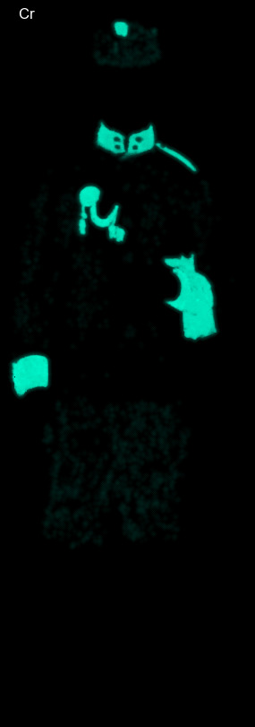

# correlate-element-maps
https://github.com/almaavu/correlate-element-maps

**Correlation of MA-XRF or SEM-EDS element maps.** 
 

### Install:
Python3

    https://www.python.org/downloads/
    
correlate-element-maps

    python -m pip install git+https://github.com/almaavu/correlate-element-maps.git

### Usage:

    python -m correlate_element_maps "d:/maps"
    
Without installation:

    python correlate_element_maps.py "d:/maps"

### Input: 
- Directory path with element maps.

### Result:
- XLSX file with correlation coefficients
- Correlation matrix image

### Sources:

https://en.wikipedia.org/wiki/Pearson_correlation_coefficient

https://imagej.net/imaging/colocalization-analysis

## Example:

### Element maps:

### Result:
<table border="1" class="dataframe">
  <thead>
    <tr style="text-align: right;">
      <th></th>
      <th>pair</th>
      <th>r2</th>
      <th>r</th>
      <th>m</th>
      <th>b</th>
    </tr>
  </thead>
  <tbody>
    <tr>
      <th>6</th>
      <td>Cr Pb-LB</td>
      <td>0.87</td>
      <td>0.93</td>
      <td>1.08</td>
      <td>-0.06</td>
    </tr>
    <tr>
      <th>1</th>
      <td>Ca Hg</td>
      <td>0.80</td>
      <td>0.90</td>
      <td>0.77</td>
      <td>0.04</td>
    </tr>
    <tr>
      <th>10</th>
      <td>Hg S</td>
      <td>0.43</td>
      <td>0.66</td>
      <td>0.56</td>
      <td>-0.12</td>
    </tr>
    <tr>
      <th>3</th>
      <td>Ca S</td>
      <td>0.21</td>
      <td>0.45</td>
      <td>0.33</td>
      <td>-0.02</td>
    </tr>
    <tr>
      <th>0</th>
      <td>Ca Cr</td>
      <td>0.01</td>
      <td>0.12</td>
      <td></td>
      <td></td>
    </tr>
    <tr>
      <th>2</th>
      <td>Ca Pb-LB</td>
      <td>0.00</td>
      <td>0.06</td>
      <td></td>
      <td></td>
    </tr>
    <tr>
      <th>8</th>
      <td>Cr Zn-KB</td>
      <td>0.00</td>
      <td>0.03</td>
      <td></td>
      <td></td>
    </tr>
    <tr>
      <th>13</th>
      <td>Pb-LB Zn-KB</td>
      <td>0.00</td>
      <td>0.01</td>
      <td></td>
      <td></td>
    </tr>
    <tr>
      <th>5</th>
      <td>Cr Hg</td>
      <td>0.00</td>
      <td>-0.02</td>
      <td></td>
      <td></td>
    </tr>
    <tr>
      <th>9</th>
      <td>Hg Pb-LB</td>
      <td>0.00</td>
      <td>-0.05</td>
      <td></td>
      <td></td>
    </tr>
    <tr>
      <th>4</th>
      <td>Ca Zn-KB</td>
      <td>0.00</td>
      <td>-0.06</td>
      <td></td>
      <td></td>
    </tr>
    <tr>
      <th>12</th>
      <td>Pb-LB S</td>
      <td>0.00</td>
      <td>-0.06</td>
      <td></td>
      <td></td>
    </tr>
    <tr>
      <th>7</th>
      <td>Cr S</td>
      <td>0.01</td>
      <td>-0.08</td>
      <td></td>
      <td></td>
    </tr>
    <tr>
      <th>11</th>
      <td>Hg Zn-KB</td>
      <td>0.08</td>
      <td>-0.29</td>
      <td></td>
      <td></td>
    </tr>
    <tr>
      <th>14</th>
      <td>S Zn-KB</td>
      <td>0.65</td>
      <td>-0.81</td>
      <td>-0.57</td>
      <td>0.45</td>
    </tr>
  </tbody>
</table>

